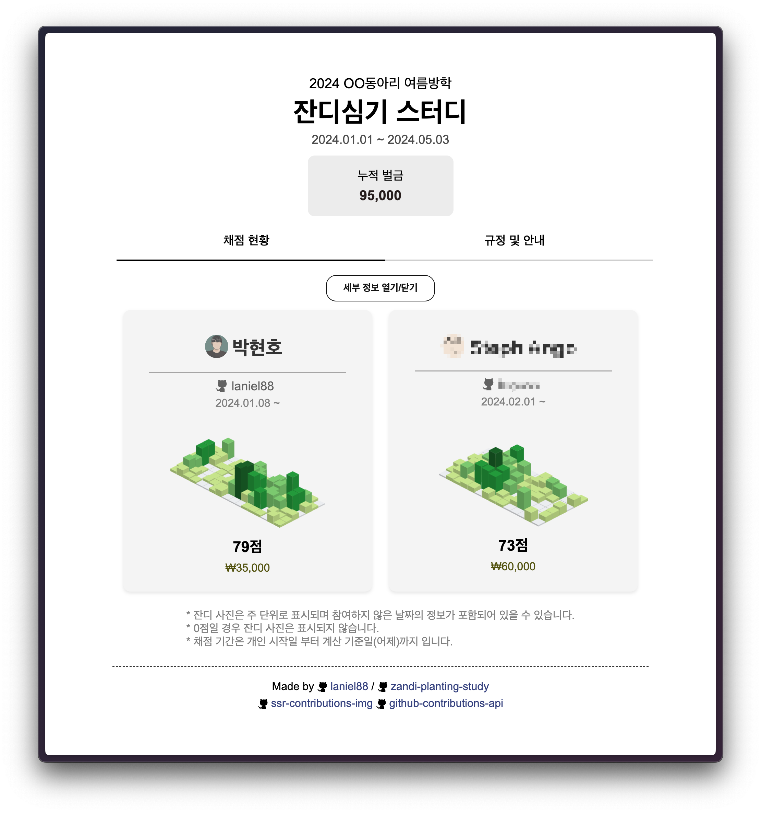

# Zandi Planting Study

잔디 심기 스터디 관리 페이지



## 실행

- `npm install` : Install dependencies
- `npm start` : Run development(local) server
- `npm run build` : Build production files
- `npm run deploy` : Deploy to GitHub Pages
  - [gh-pages](https://www.npmjs.com/package/gh-pages) 참고

## 설정법

`zandi.config.ts`에서 사이트의 설정을 변경한다.

```ts
const config: ConfigDto = {
    subtitle: `${new Date().getFullYear()} OO동아리 여름방학`,
    title: "잔디심기 스터디", 
    icon: "plant.png",
    globalStartDate: "2024-01-01",
    globalDueDate: null,
    users: [
        {
            name: "박현호",
            id: "laniel88",
            startDate: "2024-01-08",
            paid: 10000,
            timeoff: ["2024-03-25", "2024-04-01", "2024-04-02"],
        },
        // ...
    ],
    fineFormula: defaultFineFormula,
}
```

### 기본 설정

- `subtitle` : 사이트의 부제목
- `title` : 사이트의 제목
- `icon` : 사이트의 아이콘 (assets 폴더에 위치)
- `globalStartDate` : 스터디 기본 시작일
- `globalDueDate` : 스터디 마감일 (nullable)
  - `null`일 경우 마감일 오늘까지 (자동으로 늘어남)
- `users` : 회원 설정 목록

### 회원 설정

- `name` : 회원 이름
- `id` : GitHub ID
- `startDate` : 회원의 개별 스터디 시작일
  - 개별 스터디 시작일에 따라 점수와 벌금이 계산됨
  - 개별 시작일이 기본 시작일(`globalStartDate`)보다 빠를 경우 기본 시작일로 설정됨.
- `paid` : 회원이 납부한 벌금
- `timeoff` : 회원의 휴식일 목록
  - 휴식일은 벌금, 점수 계산에서 제외됨

### 벌금 공식

- `fineFormula` : 벌금 공식

`fineFormula`는 `contributions: Contribution[]`을 받아 벌금을 계산한다.

```ts
export type FineFormula = (contributions: Contribution[]) => number
```

contributions에는 날짜별 회원의 커밋 기록과 해당 날짜가 휴식일인지에 대한 정보가 담겨있다.

```ts
export interface Contribution {
    date: Date
    count: number
    timeout: boolean
}
```

기본 공식 (`defaultFineFormula`)은 1000원부터 시작해 연속한 날 동안 커밋이 없다면 벌금이 2배가 된다. (최대 8000원)

```ts
const defaultFineFormula: FineFormula = (contributions: Contribution[]) => {
    let fine = 0;
    let consecutiveZeroDays = 0;

    for (const contribution of contributions) {
        if (contribution.count === 0 && contribution.timeout == false) {
            consecutiveZeroDays++;
        } else {
            consecutiveZeroDays = 0;
        }

        if (consecutiveZeroDays > 0) {
            let temp = Math.pow(2, consecutiveZeroDays - 1) * 1000
            fine += temp > 8000 ? 8000 : temp;
        }
    }

    return fine;
}
```

## 규정 및 안내문 작성

`zandi.rulebook.md`에 규정 및 안내문을 작성한다.

